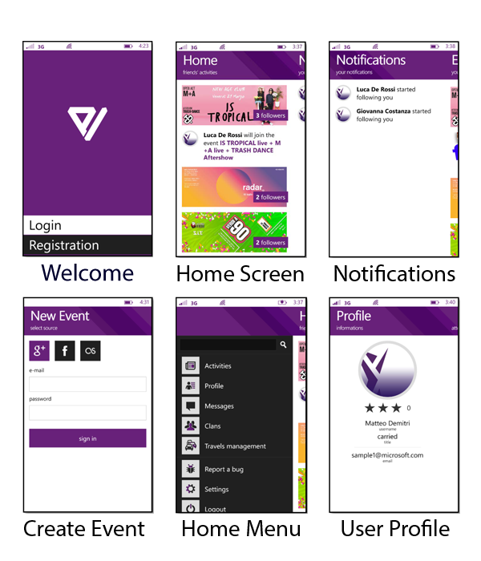

# Evius

Evius is a Windows Phone 8.0 Silverlight app presented at Microsoft Imagine Cup 2014 Italian Finals.

The social goal of Evius is actually to increase your own safety while travelling, especially by car. Would you like to drink tonight at the local club but none of your friends is willing to skip that either? Evius will allow you to find a safe (and sober) driver that will take you to the event and back home in maximum safety. 

The app is fully localized in [b]Italian[/b] and English.

At this link you can find the full documentation of the project: http://imgur.com/a/EwmuR

The app is based on Cloud resources which are currently no longer available.

Below here, a series of screenshots that show the content of the app:

## How is it built?

The app relies on the following plugins and extensions:

* WPToolkit
* Telerik Components for WP8 Silverlight
